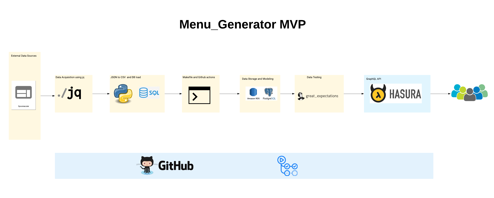
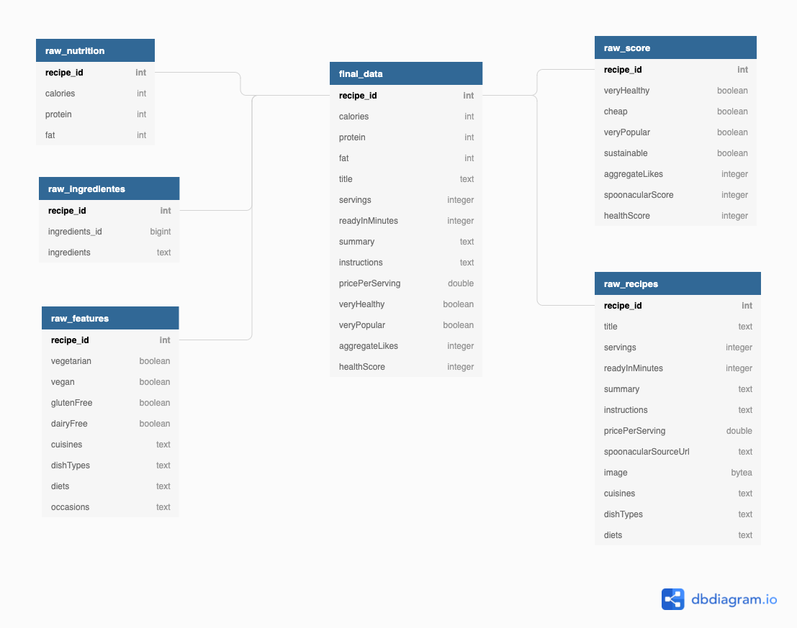

# Menu-Generator

### Problem

There are several cooking apps or websites available today, that are used to find recipes based on some keyword, like name of the food ingredient or type of cuisine, etc. These apps are mindful of the needs and interests of their users, but they fail at identifying their user's nutricional needs.
### Solution

The proposed solution system will be a GraphQL API that based on the user's choices will provide recipes with the pertinent nutricional info.

### How to?

We need to define the following:

 1. **Transform the Data:** Most of the data in the recipes will come in JSON and needs to be flattened to get our needs.
 2. **Considering User Preferences:** In the healthy food domain, learning user tastes is recognized as a crucial pre-requisite step in order to suggest dishes that users will like, for example spoonacular has a rating of the recipes.
 3. **Considering nutritional needs of users:** Nowadays, unhealthy eating habits and imbalanced nutrition increase possibilities of people having obesity and other dietary-related conditions such as diabetes, hypertension, etc. As a treatment or preventive measure, nutritionists or dietitians usually recommend regular exercises and design individualized meal plans for their patients. Unfortunately, these nutrition experts are overloaded with too many patients to manually tailor an individualized meal plan for each user. That is where food recommender systems can be used as an intelligent nutrition consultation system.
 4. **Filter the menus by nutricional needs and special menus:**
 - [x] Filter recipes by diets:  vegetarian, vegan, pescatarian, etc.
 - [x] Filter recipes by Cuisine: Thai. Italian, Greek, Peruvian. Chinese, etc.
 - [x] Filtering recipes by calories: for example, 200, 500, etc.
 - [x] Filtering recipes by scores: for example, Very healthy, likes, etc

### **Infraestructure:**

 - Data Aquisition:   [Spoonacular API](https://spoonacular.com/food-api/docs)
 - jq to get the JSON files and Python to convert them into CSV
 - Storage using [Amazon RDS - PostgresDB](https://aws.amazon.com/free/?all-free-tier.sort-by=item.additionalFields.SortRank&all-free-tier.sort-order=asc&awsf.Free%20Tier%20Types=*all&awsf.Free%20Tier%20Categories=categories%23databases&trk=ps_a134p000006paacAAA&trkCampaign=acq_paid_search_brand&sc_channel=PS&sc_campaign=acquisition_DACH&sc_publisher=Google&sc_category=Database&sc_country=DACH&sc_geo=EMEA&sc_outcome=acq&sc_detail=aws%20postgre%20sql&sc_content=Postgresql_e&sc_matchtype=e&sc_segment=495000475407&sc_medium=ACQ-P|PS-GO|Brand|Desktop|SU|Database|Solution|DACH|EN|Text|xx|EU&s_kwcid=AL!4422!3!495000475407!e!!g!!aws%20postgre%20sql&ef_id=Cj0KCQjwwLKFBhDPARIsAPzPi-IZq80to9E2nKMmtPVHBCwVLuQNIJp7k8HAJcPe-ciqgJE6Cu-7UbcaAqw9EALw_wcB:G:s&s_kwcid=AL!4422!3!495000475407!e!!g!!aws%20postgre%20sql) to store the raw and the model the data.
 - [Great Expectations ](https://greatexpectations.io/) to test the data and tables.
 - [Hasura Cloud](https://hasura.io/cloud/) to serve the data via a GraphQL API
 - Orchestration using [Github Actions](https://github.com/features/actions) to run the jobs via Makefile as well as the jobs coming from Great Expections.
 - CI/CD [GitHub](https://github.com/)

### **Initial Project Arquitecture:**

### **Database Diagram:**

### **Project Status:**

- Phase 1 Completed
- Phase 2 Generate menus automatically