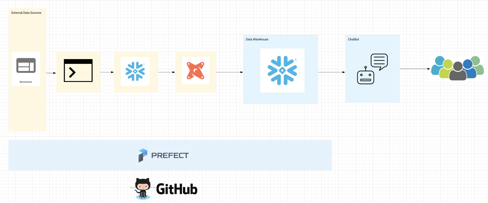

# Menu-Generator

### Problem

There are several cooking apps or websites available today, that are used to find recipes based on some keyword, like name of the food ingredient or type of cuisine, etc. These apps are mindful of the needs and interests of their users, but they fail at identifying their user's constraints, i.e., limited number of food ingredients. In such cases, users find themselves shopping for ingredients or they decide to substitute the missing ingredient with something else.

### Solution

The proposed solution system will be a chatbot that based on the user's choices will provide menus or recipes with the pertinent nutricional info.

### How to?

We need to define the following:

 1. **Transform the Data:** Most of the data in the receipes comes in Imperial System so needs to be transformed to Metric System, also the data will come in JSON and needs to be flattened to get our neeeds.
 2. **Considering User Preferences:** In the healthy food domain, learning user tastes is recognized as a crucial pre-requisite step in order to suggest dishes that users will like, for example spoonacular has a rating of the recipes.
 3. **Considering nutritional needs of users:** Nowadays, unhealthy eating habits and imbalanced nutrition increase possibilities of people having obesity and other dietary-related conditions such as diabetes, hypertension, etc. As a treatment or preventive measure, nutritionists or dietitians usually recommend regular exercises and design individualized meal plans for their patients. Unfortunately, these nutrition experts are overloaded with too many patients to manually tailor an individualized meal plan for each user. That is where food recommender systems can be used as an intelligent nutrition consultation system.
 4. **Filter the menus by nutricional needs and special menus:**
 - [x] Filter menu by needs:  High Carbs, Low Carbs, Whole 30, Paleo, etc.
 - [x] Filter menu by Cusine: Thai. Italian, Greek, Peruvian. Chinese, etc.
 - [x] Filtering menus by calories: for example, 800, 1200, 1600, 2000, 2400, etc.
 5.  **Generate, unique recipe, menu daily, weekly, monthly. etc**

**Nice to accomplish: Obtain list of ingredients in a response mapped to the supermarket where you can buy it.**

### **Infraestructure:**

 - Data Aquisition:   [Spoonacular API](https://spoonacular.com/food-api/docs)
 - jq to get the JSON files and convert them into CSV
 - Storage using [Snowflake](https://signup.snowflake.com/?_bt=470247377999&_bk=snowflake&_bm=e&_bn=g&_bg=82133793333&&utm_medium=search&utm_source=adwords&utm_campaign=EMEA%20-%20Branded%20-%20Exact&utm_adgroup=EMEA%20-%20Branded%20-%20Snowflake%20-%20Exact%20RSA&utm_term=snowflake&utm_region=emea&gclid=Cj0KCQjw6-SDBhCMARIsAGbI7UiBDky3T8ZoRxe7xM4YwFW3Jn6Wd-kTKBxnPK1w17KJ4rMP71KLw4gaArY7EALw_wcB&gclsrc=aw.ds) to store the raw and the modeled data.
 - [DBT](https://www.getdbt.com/) model Data 
 - Orchestration using [Prefect](https://www.prefect.io/cloud/) to run the jobs via Makefile as well as the jobs coming from DBT
 - CI/CD [GitHub](https://github.com/)

### **Proposed Project Arquitecture:**

### **Project Planing:**

You can find the Project Plan in the following Trello [Board](https://trello.com/b/KO0xE3Y9/healthy-menu-reco-sys), if you have any suggestion please feel free to add it as a card in Trello. 

### **Project Status:**

In development

Addendum by Daniel
-------

Your first action point is to understand the data sources, figure common structures, and start modeling your data!

Great job!
